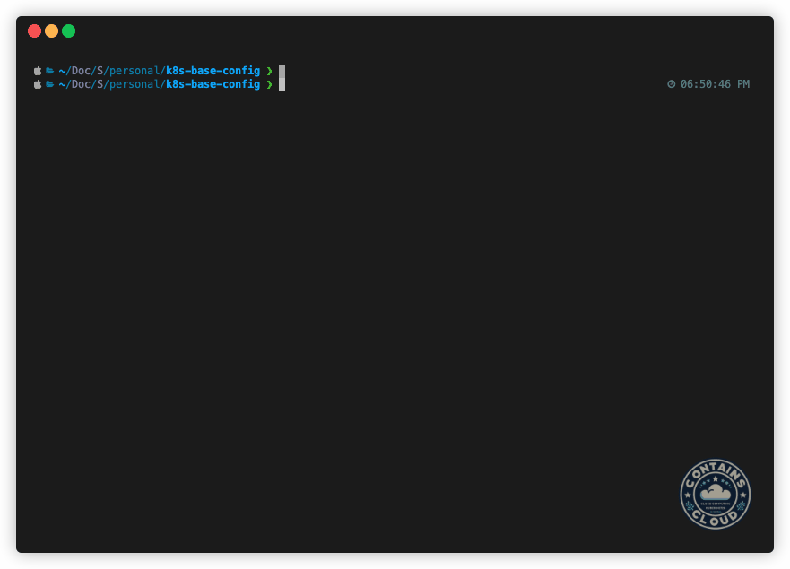

## Kubernetes Base config

:page_facing_up: The files available in this repository are part of [How to accelerate the Kubernetes cluster configuration using FluxCD – Part1
](https://containscloud.com/2024/04/26/how-to-accelerate-the-kubernetes-cluster-configuration-using-fluxcd-part1/) post blog of [contains(cloud)](https://containscloud.com) ☁️

:computer: The EKS cluster used to this lab is available on: [EKS Lab Cluster](https://github.com/diego7marques/eks-lab-cluster)

Technologies used:

[](#)

Thanks to [FluxCD](https://fluxcd.io/) project.

## How to install FluxCD using the repository code

1. Fork the repository

2. Run the following code changing the "owner":
```bash
### A PAT with read and write access to the repository must be provided.
export GITHUB_TOKEN=<myPAT> 

flux bootstrap github \
  --token-auth \
  --owner=<you> \
  --repository=k8s-base-config \
  --branch=main \
  --path=global-config \
  --personal
```

The result must be like:




## License

This code is licensed under the [MIT License](LICENSE).